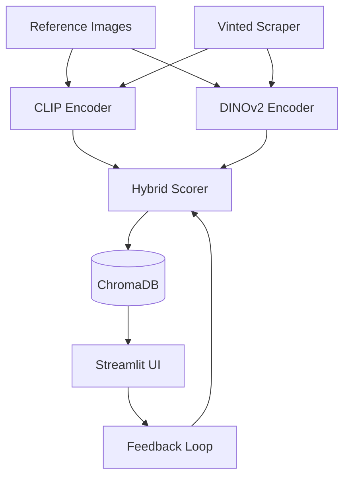

# 🔍 FashionMatch

**Visual fashion search powered by dual AI embeddings (CLIP + DINOv2)**

Find similar fashion items using semantic and structural image analysis with adaptive fusion weights and interactive feedback.

[](https://www.python.org/downloads/)
[](LICENSE)

---

## ✨ Features

- 🤖 **Dual AI Encoders**: CLIP (semantic) + DINOv2 (structural) for comprehensive similarity
- 🎯 **Hybrid Fusion**: Weighted combination with dynamic adjustment via user feedback
- 🕷️ **Web Scraping**: Automated Vinted data collection with Playwright
- 💾 **Vector Database**: ChromaDB for efficient similarity search
- 🎨 **Interactive UI**: Streamlit interface with real-time feedback loop
- 📊 **Performance Monitoring**: Built-in profiling and metrics
- 🧪 **Comprehensive Tests**: Unit and integration test suite

---

## 🚀 Quick Start

### Installation

```bash
# Clone repository
git clone https://github.com/yourusername/fashionmatch.git
cd fashionmatch

# Create virtual environment
python -m venv venv
source venv/bin/activate  # Linux/Mac
# or
.\venv\Scripts\activate   # Windows PowerShell

# Install dependencies
pip install -r requirements.txt
playwright install chromium
```

### Usage

```bash
# 1. Scrape fashion items
python -m src.scraper.cli --category "chemises" --pages 5

# 2. Generate embeddings
python -m src.core.embedding_pipeline --mode all

# 3. Launch UI
streamlit run src/ui/app.py
```

Access the UI at `http://localhost:8501`

---

## 📖 Documentation

- **[Setup Guide](docs/SETUP.md)** - Installation and configuration
- **[Usage Guide](docs/USAGE.md)** - Scraping, encoding, and searching
- **[Architecture](docs/ARCHITECTURE.md)** - System design and data flow
- **[API Reference](docs/API.md)** - Module and function documentation

---

## 🏗️ Architecture



### Key Components

- **Dual Encoders**: CLIP (semantic understanding) + DINOv2 (structural analysis)
- **Late Fusion**: Weighted combination (α·CLIP + β·DINO)
- **Vector Store**: ChromaDB with dual collections (CLIP + DINO)
- **Web Scraper**: Playwright-based with retry logic and rate limiting
- **Feedback Loop**: Dynamic weight adjustment based on user interactions

---

## 🧪 Testing

```bash
# Run all tests
pytest tests/ -v --cov=src

# Run unit tests only
pytest tests/unit/ -v

# Run integration tests
pytest tests/integration/ -v

# With coverage report
pytest tests/ -v --cov=src --cov-report=html
```

---

## 📊 Performance

| Operation | Latency (GPU) | Throughput |
|-----------|---------------|------------|
| CLIP Encoding | ~50ms/image | ~20 images/sec |
| DINOv2 Encoding | ~80ms/image | ~12 images/sec |
| Vector Search | <50ms | ~1000 queries/sec |
| Batch Insertion | ~2s/100 items | ~50 items/sec |

*Benchmarks on NVIDIA RTX 3080, batch size 32*

---

## 🎯 Use Cases

### Fashion Designer
- Upload design sketches as references
- Find similar real products on Vinted
- Analyze market trends and pricing

### Vintage Collector
- Search for similar vintage items
- Track rare pieces across categories
- Build curated collections

### Style Consultant
- Match client preferences to available items
- Create personalized shopping recommendations
- Discover new brands and styles

---

## 🔧 Configuration

Edit `config/config.yaml`:

```yaml
models:
  clip_model: "openai/clip-vit-base-patch32"
  dino_model: "dinov2_vits14"
  fusion_weights:
    clip: 0.6  # Semantic weight
    dino: 0.4  # Structural weight
  device: "auto"  # or "cuda" / "cpu"

database:
  persist_directory: "./data/chroma"
  batch_size: 32
  distance_metric: "cosine"

scraper:
  base_url: "https://www.vinted.fr"
  delay_range: [1.0, 3.0]
  max_retries: 3
  headless: true
```

---

## 📁 Project Structure

```
fashionmatch/
├── src/
│   ├── core/              # AI encoders and scorer
│   ├── database/          # Vector store and models
│   ├── scraper/           # Web scraping
│   ├── ui/                # Streamlit interface
│   └── utils/             # Configuration, logging, performance
├── tests/
│   ├── unit/              # Unit tests
│   └── integration/       # Integration tests
├── notebooks/             # Jupyter notebooks
├── docs/                  # Documentation
├── data/
│   ├── references/        # Reference images
│   ├── scraped/           # Scraped data
│   └── chroma/            # Vector database
├── config/                # Configuration files
└── logs/                  # Application logs
```

---

## 🤝 Contributing

Contributions welcome! Please:

1. Fork the repository
2. Create a feature branch (`git checkout -b feature/amazing-feature`)
3. Commit changes (`git commit -m 'Add amazing feature'`)
4. Push to branch (`git push origin feature/amazing-feature`)
5. Open a Pull Request

### Development Setup

```bash
# Install test dependencies
pip install pytest pytest-cov pytest-asyncio pytest-mock

# Run tests
pytest tests/ -v

# Install Jupyter for notebooks
pip install jupyter matplotlib seaborn

# Run code quality checks
black src/ tests/
ruff check src/ tests/
```

---

## 📝 License

This project is licensed under the MIT License - see [LICENSE](LICENSE) file for details.

---

## 🙏 Acknowledgments

- **OpenAI CLIP** - Semantic image understanding
- **Meta DINOv2** - Self-supervised visual features
- **ChromaDB** - Vector database
- **Hugging Face** - Model hosting and transformers library
- **Streamlit** - Interactive UI framework

---

## 📫 Contact

- **Issues**: [GitHub Issues](https://github.com/yourusername/fashionmatch/issues)
- **Discussions**: [GitHub Discussions](https://github.com/yourusername/fashionmatch/discussions)
- **Email**: your.email@example.com

---

## 🗺️ Roadmap

- [ ] Multi-language support (English, French, Spanish)
- [ ] Additional scraper targets (eBay, Depop, Poshmark)
- [ ] Advanced filtering (color, pattern, material)
- [ ] Collaborative filtering recommendations
- [ ] Mobile app (React Native)
- [ ] API endpoint for integration
- [ ] Cloud deployment guide (AWS, GCP, Azure)

---

## ⭐ Star History

If you find this project useful, please consider giving it a star!

---

**Built with ❤️ using Python, PyTorch, and open-source AI models**
