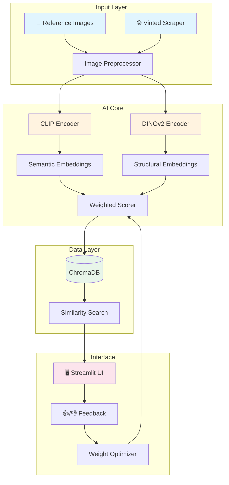

# 🎨 FashionMatch

> An intelligent clothing recommendation engine for Vinted, powered by hybrid computer vision (CLIP + DINOv2).

[](https://python.org)
[](LICENSE)
[](#disclaimer)

---

## 📋 Overview

**FashionMatch** is a personal fashion recommendation system that learns your clothing preferences from reference images and suggests relevant items from Vinted. 

The system uses a **hybrid AI approach** combining semantic understanding (CLIP) with structural analysis (DINOv2) to provide highly accurate style matching that goes beyond simple visual similarity.

### 🎯 Key Features

- **Preference Learning**: Upload reference images to teach the system your style
- **Hybrid Matching**: Combines semantic and structural embeddings for superior accuracy
- **Automated Scraping**: Fetches listings from Vinted using Playwright
- **Vector Search**: Fast similarity search with ChromaDB
- **Interactive Feedback**: Streamlit UI with like/dislike feedback loop

---

## 🧠 Why Hybrid? (CLIP + DINOv2)

Traditional image similarity relies on a single model, but fashion matching requires understanding **both** the abstract concept and the precise details of clothing.

### The Two Pillars

| Model | Strength | What It Captures |
|-------|----------|------------------|
| **CLIP** (OpenAI) | Semantic Understanding | Style, vibe, context, "feeling" of the outfit |
| **DINOv2** (Meta) | Structural Analysis | Geometry, texture, patterns, material details |

### Late Fusion Strategy

```
Reference Image
      │
      ├──► CLIP Encoder ──► Semantic Embedding ──┐
      │                                          │
      │                                          ▼
      │                                   Weighted Average
      │                                   (α·CLIP + β·DINO)
      │                                          │
      └──► DINOv2 Encoder ──► Structural Embedding ──┘
                                                 │
                                                 ▼
                                         Final Similarity Score
```

**Why Late Fusion?**
- Preserves the unique strengths of each model
- Allows dynamic weight adjustment based on user feedback
- Simple yet effective combination strategy

---

## 🏗️ Architecture



### Data Flow

1. **Ingestion**: Reference images + scraped Vinted listings
2. **Encoding**: Dual embedding generation (CLIP + DINOv2)
3. **Storage**: Embeddings persisted in ChromaDB
4. **Matching**: Cosine similarity with late fusion scoring
5. **Feedback**: User preferences refine the weighting

---

## 🛠️ Tech Stack

| Category | Technology | Purpose |
|----------|------------|---------|
| **Language** | Python 3.10+ | Core development |
| **Semantic AI** | CLIP (OpenAI) | Style/context understanding |
| **Structural AI** | DINOv2 (Meta) | Pattern/texture analysis |
| **Scraping** | Playwright | Dynamic JS content handling |
| **Vector DB** | ChromaDB | Embedding storage & search |
| **Interface** | Streamlit | Interactive web UI |
| **Config** | Pydantic + YAML | Type-safe configuration |

---

## 📦 Installation

### Prerequisites

- Python 3.10 or higher
- Git
- CUDA-compatible GPU (recommended) or CPU

### Setup

```bash
# Clone the repository
git clone https://github.com/yourusername/fashionmatch.git
cd fashionmatch

# Create virtual environment
python -m venv venv
source venv/bin/activate  # Linux/Mac
# or
.\venv\Scripts\activate   # Windows

# Install dependencies
pip install -r requirements.txt

# Install Playwright browsers
playwright install chromium

# Copy and configure settings
cp config/config.example.yaml config/config.yaml
```

### Configuration

Edit `config/config.yaml` to customize:

```yaml
models:
  clip_model: "ViT-B/32"
  dino_model: "dinov2_vits14"
  fusion_weights:
    clip: 0.5
    dino: 0.5

scraper:
  base_url: "https://www.vinted.fr"
  max_pages: 10
  delay_range: [1, 3]

database:
  persist_directory: "./data/chroma"
  collection_name: "vinted_items"
```

---

## 🚀 Usage

### 1. Add Reference Images

Place your style reference images in the `data/references/` folder.

### 2. Run the Scraper

```bash
python -m src.scraper.vinted_scraper --category "chemises" --pages 5
```

### 3. Generate Embeddings

```bash
python -m src.core.embedding_pipeline
```

### 4. Launch the UI

```bash
streamlit run src/ui/app.py
```

### 5. Explore & Provide Feedback

- Browse recommended items
- Use 👍/👎 buttons to refine suggestions
- Watch the system learn your preferences!

---

## 📁 Project Structure

```
fashionmatch/
├── config/
│   ├── config.yaml          # Main configuration
│   └── config.example.yaml  # Template
├── data/
│   ├── references/           # Your style images
│   ├── scraped/              # Raw scraped data
│   └── chroma/               # Vector database
├── src/
│   ├── core/                 # AI models & scoring
│   │   ├── encoders/
│   │   │   ├── clip_encoder.py
│   │   │   └── dino_encoder.py
│   │   ├── scorer.py
│   │   └── embedding_pipeline.py
│   ├── scraper/              # Vinted scraping
│   │   ├── vinted_scraper.py
│   │   └── parsers.py
│   ├── database/             # ChromaDB operations
│   │   ├── vector_store.py
│   │   └── models.py
│   ├── ui/                   # Streamlit interface
│   │   ├── app.py
│   │   └── components/
│   └── utils/                # Shared utilities
│       ├── config.py
│       ├── image_utils.py
│       └── logger.py
├── tests/                    # Unit & integration tests
├── notebooks/                # Experimentation
├── requirements.txt
├── PLAN.md                   # Technical roadmap
└── README.md
```

---

## 🧪 Testing

```bash
# Run all tests
pytest tests/ -v

# Run with coverage
pytest tests/ --cov=src --cov-report=html
```

---

## 📊 Performance Metrics

| Metric | Target | Description |
|--------|--------|-------------|
| Embedding Speed | < 100ms/image | GPU inference time |
| Search Latency | < 50ms | ChromaDB query time |
| Precision@10 | > 70% | Relevant items in top 10 |

---

## 🔮 Future Improvements

- [ ] Multi-modal search (text + image queries)
- [ ] Price-aware recommendations
- [ ] Size compatibility filtering
- [ ] A/B testing for fusion strategies
- [ ] Export to mobile app

---

## ⚠️ Disclaimer

> **Educational Project**: This project is developed for learning purposes and portfolio demonstration. It is not affiliated with Vinted. Please respect Vinted's Terms of Service and rate limits when using the scraper.

---

## 📄 License

This project is licensed under the MIT License - see the [LICENSE](LICENSE) file for details.

---

## 🙏 Acknowledgments

- [OpenAI CLIP](https://github.com/openai/CLIP) - Semantic image understanding
- [Meta DINOv2](https://github.com/facebookresearch/dinov2) - Self-supervised vision
- [ChromaDB](https://www.trychroma.com/) - Vector database
- [Streamlit](https://streamlit.io/) - Rapid UI development

---

<p align="center">
  Made with ❤️ for fashion & AI
</p>
