# FashionMatch Architecture

System design, data flow, and technical implementation details.

## System Overview

FashionMatch is a dual-encoder visual search system combining semantic (CLIP) and structural (DINOv2) understanding through late fusion with adaptive weights.

```mermaid
graph TB
    subgraph Input
        A[Reference Images]
        B[Vinted Scraper]
    end
    
    subgraph Encoding["Encoding Layer"]
        C[CLIP Encoder<br/>ViT-B/32]
        D[DINOv2 Encoder<br/>vits14]
        E[Hybrid Scorer<br/>α·CLIP + β·DINO]
    end
    
    subgraph Storage["Storage Layer"]
        F[(ChromaDB CLIP<br/>Collection)]
        G[(ChromaDB DINO<br/>Collection)]
    end
    
    subgraph Interface["Interface Layer"]
        H[Streamlit UI]
        I[Feedback Loop]
        J[Filter Engine]
    end
    
    A --> C
    A --> D
    B --> C
    B --> D
    C --> E
    D --> E
    E --> F
    E --> G
    F --> H
    G --> H
    H --> I
    I --> E
    H --> J
    J --> H
```



---

## Core Components

### 1. Dual Encoder Pipeline

#### CLIP Encoder (OpenAI)
- **Model**: Vision Transformer (ViT)
- **Variants**: ViT-B/32 (512d), ViT-B/16 (512d), ViT-L/14 (768d)
- **Strength**: Semantic understanding (style, context, vibe)
- **Training**: Contrastive learning on 400M image-text pairs
- **Use Case**: "Find items with similar style/aesthetic"

#### DINOv2 Encoder (Meta)
- **Model**: Vision Transformer (ViT)
- **Variants**: vits14 (384d), vitb14 (768d), vitl14 (1024d), vitg14 (1536d)
- **Strength**: Structural analysis (patterns, textures, geometry)
- **Training**: Self-supervised on 142M images
- **Use Case**: "Find items with similar visual structure"

#### Late Fusion Scoring
```python
score = α * cosine_similarity(query_clip, candidate_clip) + 
        β * cosine_similarity(query_dino, candidate_dino)
```

Where α + β = 1.0 (normalized weights)

**Why Late Fusion?**
- Preserves individual model strengths
- Enables dynamic weight adjustment
- Supports model-specific analysis
- Facilitates A/B testing

---

### 2. Vector Store (ChromaDB)

#### Dual-Collection Architecture

**CLIP Collection** (Source of Truth)
- Stores: CLIP embeddings + full metadata
- Metadata: item_id, title, price, url, brand, category, etc.
- Indexed by: item_id

**DINO Collection** (Auxiliary)
- Stores: DINOv2 embeddings + item_id only
- Minimal metadata for sync
- Indexed by: item_id

#### Why Dual Collections?

1. **Dimensional Independence**: CLIP (512d) ≠ DINO (384d)
2. **Selective Search**: Query only relevant collection
3. **Metadata Management**: Single source of truth
4. **Performance**: Optimized index per modality

#### Distance Metrics

- **Cosine Similarity** (default): Angle between vectors, scale-invariant
- **L2 (Euclidean)**: Geometric distance, sensitive to magnitude
- **Inner Product**: Unnormalized cosine, faster computation

---

### 3. Web Scraper (Playwright)

#### Architecture

```
VintedScraper
├── Browser Manager (Playwright)
├── Page Navigator
├── HTML Parser (BeautifulSoup)
├── Retry Handler (Exponential Backoff)
└── Image Downloader (Async)
```

#### Parsing Strategy

**Priority Order:**
1. **JSON-LD** (`<script type="application/ld+json">`)
   - Structured data, reliable
2. **Embedded JavaScript** (`window.__INITIAL_STATE__`)
   - Fallback for SPA content
3. **CSS Selectors** (`.item-title`, `.item-price`)
   - Last resort for missing structured data

#### Anti-Detection Measures

- User-agent rotation
- Random delays (1-3s between requests)
- Headless mode (configurable)
- Rate limiting (max requests/minute)
- Session management

---

### 4. Feedback Loop

#### Weight Adjustment Algorithm

```python
def adjust_weights(feedback, clip_score, dino_score):
    # Identify better-performing model
    clip_better = clip_score > dino_score
    
    if feedback == "like":
        # Increase weight of better model
        if clip_better:
            α += 0.05
        else:
            β += 0.05
    else:  # dislike
        # Decrease weight of better model
        if clip_better:
            α -= 0.05
        else:
            β -= 0.05
    
    # Normalize
    total = α + β
    return α / total, β / total
```

#### Feedback Effects

| Scenario | CLIP Score | DINO Score | Feedback | α Change | β Change |
|----------|------------|------------|----------|----------|----------|
| 1 | 0.9 | 0.7 | 👍 Like | +0.05 | -0.05 |
| 2 | 0.6 | 0.8 | 👍 Like | -0.05 | +0.05 |
| 3 | 0.9 | 0.7 | 👎 Dislike | -0.05 | +0.05 |
| 4 | 0.6 | 0.8 | 👎 Dislike | +0.05 | -0.05 |

---

## Data Flow

### 1. Ingestion Pipeline

```
Raw Image → Resize (224×224) → Normalize → Tensor → Encoder → L2 Normalize → Vector
```

**Preprocessing Steps:**
1. **Load**: PIL.Image.open()
2. **Convert**: Ensure RGB mode
3. **Resize**: Bilinear interpolation to 224×224
4. **Normalize**: Model-specific mean/std
5. **Tensorize**: HWC → CHW format

### 2. Search Workflow

```
Query Image → Encode (CLIP + DINO) → Search Collections → Merge Results → Fuse Scores → Rank → Filter → Paginate
```

**Step-by-Step:**

1. **Encode Query**
   - Dual encoding (CLIP + DINO)
   - L2 normalization

2. **Parallel Search**
   - Query CLIP collection (top_k × 2)
   - Query DINO collection (top_k × 2)

3. **Merge Results**
   - Match by item_id
   - Handle CLIP-only or DINO-only items

4. **Fuse Scores**
   - Apply fusion weights (α, β)
   - Re-rank by fused score

5. **Post-Processing**
   - Apply filters (price, category, similarity)
   - Sort by selected criterion
   - Paginate results

### 3. Embedding Pipeline

```
Directory Scan → Validate Images → Batch Load → Encode (CLIP + DINO) → Store in ChromaDB → Update Stats
```

**Incremental Processing:**
- Check existing item_ids in database
- Skip already-processed items
- Process only new/modified items
- Update statistics

---

## Performance Characteristics

### Latency Breakdown

| Operation | CPU (ms) | GPU (ms) | Notes |
|-----------|----------|----------|-------|
| Image Load | 5-10 | 5-10 | I/O bound |
| CLIP Encode | 200-300 | 40-60 | Model inference |
| DINO Encode | 300-400 | 60-100 | Larger model |
| Vector Search | 20-50 | 20-50 | ChromaDB query |
| Score Fusion | <1 | <1 | Simple arithmetic |
| **Total (Single)** | **~550ms** | **~150ms** | End-to-end |

### Throughput (Batch Processing)

| Batch Size | CPU (img/s) | GPU (img/s) | Memory (MB) |
|------------|-------------|-------------|-------------|
| 1 | 1.8 | 6.5 | 200 |
| 8 | 2.5 | 15 | 800 |
| 16 | 3.0 | 20 | 1500 |
| 32 | 3.2 | 25 | 2800 |
| 64 | 3.5 | 28 | 5000 |

*Benchmarks on Intel i7-12700K + NVIDIA RTX 3080*

### Scalability

**Vector Store:**
- **Small**: <10K items, <100ms search
- **Medium**: 10K-100K items, 100-500ms search
- **Large**: >100K items, >500ms search (consider ANN indexing)

**Recommended Limits:**
- Items per batch: 32-64 (GPU), 8-16 (CPU)
- Concurrent scrapers: 3-5
- Max database size: 500K items (without optimization)

---

## Design Decisions

### Why Two Encoders?

**CLIP Limitations:**
- Focuses on high-level semantics
- May miss fine-grained textures

**DINOv2 Advantages:**
- Captures low-level visual features
- Better at structural similarity

**Combined:** Best of both worlds

### Why ChromaDB?

- Python-native, easy integration
- Supports multiple distance metrics
- Built-in persistence
- No separate server required
- Active development

**Alternatives Considered:**
- FAISS: More complex setup
- Milvus: Requires server
- Weaviate: Overkill for this scale

### Why Streamlit?

- Rapid prototyping
- Python-native (no JS needed)
- Built-in session state
- Auto-reload during development
- Easy deployment

**Alternatives Considered:**
- Gradio: Less customizable
- Flask + React: More complex
- FastAPI + Vue: Overkill

---

## Security & Privacy

### Data Handling

- **Local Processing**: All data stays on your machine
- **No Telemetry**: No usage tracking
- **No API Keys**: Self-hosted models
- **GDPR Compliant**: No personal data collection

### Scraping Ethics

- Respect robots.txt
- Rate limiting enforced
- User-agent disclosure
- For research/personal use only

---

## Future Enhancements

### Performance
- [ ] ANN indexing for large databases (HNSW)
- [ ] Model quantization (INT8)
- [ ] Embedding caching
- [ ] Batch search API

### Features
- [ ] Multi-modal search (text + image)
- [ ] Color/pattern filters
- [ ] Price prediction model
- [ ] Collaborative filtering

### Infrastructure
- [ ] Docker deployment
- [ ] Cloud storage integration (S3)
- [ ] Distributed scraping
- [ ] API endpoints

---

## References

- [CLIP Paper](https://arxiv.org/abs/2103.00020) - OpenAI
- [DINOv2 Paper](https://arxiv.org/abs/2304.07193) - Meta
- [ChromaDB Docs](https://docs.trychroma.com/)
- [Streamlit Docs](https://docs.streamlit.io/)

---

**Architecture Version**: 1.0  
**Last Updated**: December 2025
